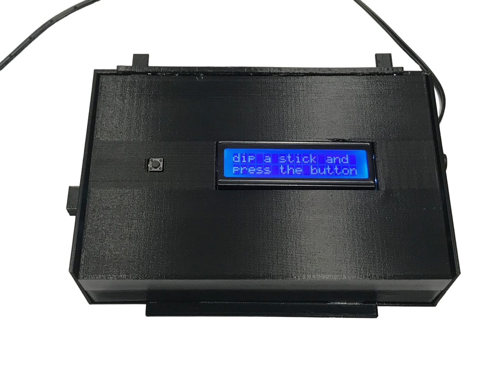

# ProteinProblem: A Digitized At-Home Urinalysis Device for Chronic Kidney Patients (2019)

  
<i>Urinalysis Device</i>

## Overview

This repository contains models and code for ProteinProblem, a Grade 9 (2019) personal project to develop a handheld urinalysis device to help chronic kidney patients monitor their conditions. The project was motivated by personal experience as a kidney patient and aims to provide a cost-effective, portable, and accurate tool for monitoring protein levels in urine.

More information about the project can be found in the Canadian Science Fair Journal [here](https://csfjournal.com/volume-2-issue-5/2020/3/11/protein-problem-a-digitized-at-home-urinalysis-device-to-aid-patients-suffering-from-kidney-disease).

## Our Solution

The ProteinProblem device improves the accuracy and convenience of at-home urinalysis for chronic kidney patients by:

1. **Colorimetric Analysis**: The device uses a color sensor read color on urinalysis strips, which indicate protein levels in urine. This method is more reliable than subjective visual interpretation.
2. **Data Analysis**: The device is Bluetooth-enabled, allowing patients to store their urinalysis results over time. This enables healthcare providers to make informed patient tailored decisions based on long-term data.

## Setup

1. **3D Print the Case**: Use the provided STL files to print the controlled color sensing chamber with light-absorbing filament to prevent external light interference.
2. **Wire Together the Hardware**:
    - Connect the LCD screen to the Arduino using the following pins: RS (12), E (11), D4 (5), D5 (4), D6 (3), D7 (2).
    - Connect the TCS3200 color sensor to the Arduino: GND, S0 (6), S1 (7), S2 (8), S3 (9), OUT (13).
    - Connect the HC-05 Bluetooth module to the Arduino: VCC (3.3V), GND, TX (RX of Arduino), RX (TX of Arduino).
    - Wire the push button to the Arduino with a 5.1k Ohm resistor.
3. **Flash the Firmware**: Use the Arduino IDE or `avrdude` to upload the provided Arduino sketch to the Arduino Uno R3.
4. **Build Calibration Curve and Calculation Model**: Test with different concentrations of albumin solutions to generate a calibration curve. Implement a calculation model based on your sensor's response.
5. **Optional: Connect Using HC-05 Bluetooth Module**: Pair the device with an external application using the HC-05 Bluetooth module to transmit data wirelessly.

## Hardware

- **Arduino Uno R3**: Used as the main microcontroller.
- **16x2 LCD Screen**: Displays information such as protein levels detected.
- **TCS3200 Color Sensor**: Detects color changes on urinalysis strips to determine protein levels.
- **HC-05 Bluetooth Module**: Facilitates wireless communication with a smartphone.

## Files

- **STL Files**: 3D printable files for the controlled color sensing chamber.
- **Arduino Sketch**: The main code for operating the urinalysis device.

## License

This work is licensed under the [GNU General Public License v3.0](https://www.gnu.org/licenses/gpl-3.0.en.html).

